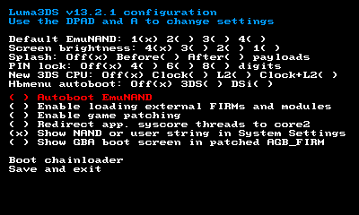
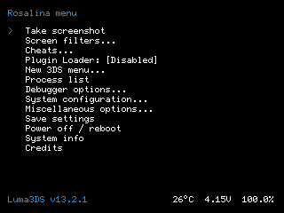

# Luma3DS

*"Custom Firmware" para Nintendo 3DS*

## Descripción
**Luma3DS** parchea y reimplementa partes importantes del software del sistema que se ejecuta en todos los modelos de la familia de consolas Nintendo 3DS. Su objetivo es mejorar enormemente la experiencia del usuario y darle soporte a la 3DS mucho más allá de su fin de vida.
Características:

* **Soporte de primera clase para aplicaciones homebrew**
* **Rosalina**, un menú superpuesto (activado por <kbd>L+Abajo+Select</kbd> por defecto), permitiendo cosas como:
    * Hacer capturas de pantalla mientras juegas a un juego
    * Filtros de luz azul y otros filtros de pantalla
    * Input redirection para jugar con dispositivos externos, como mandos
    * Usar trucos
    * Configuración de fecha y hora con precisión desde la red (NTP)
    * ... y mucho más!
* **Muchas funcionalidades para mods de juegos**, como, entre otras:
    * Plugins para juegos (en formato 3GX)
    * Sobrescritura de idioma por juego ("emulacion local")
    * Redirección de ruta de assets ("LayeredFS")
* **Soporte para parches proporcionados por el usuario y/o reemplazos completos de "módulos del sistema"**, una característica esencial para los reemplazos de Nintendo Network (entre otros proyectos)
* Un **código auxiliar de GDB completo**, que permite a los desarrolladores de homebrew y a los ingenieros de ingeniería inversa trabajar de manera mucho más eficiente
* Capacidad de cargar en cadena otros archivos de firmware, incluidas otras versiones de sí mismo
* ... y mucho más!

## Instalación y Actualización
Luma3DS requiere [boot9strap](https://github.com/SciresM/boot9strap) para ejecutarse.

Una vez instalado boot9strap, simplemente descarga la [última versión](https://github.com/LopezTutoriales/Luma3DS-Spanish/releases/latest) y extrae el archivo en la raíz de tu SD para "instalar" o actualizar Luma3DS junto con el [menú homebrew y paquete de certificados](https://github.com/devkitPro/3ds-hbmenu) incluido con él. Reemplaza los archivos y carpetas existentes si es necesario.

## Uso Básico
**El menú de configuración de Luma3DS** puede abrirse pulsando <kbd>Select</kbd> al encender la consola. El archivo de configuración está en `/luma/config.ini` en tu SD (o en `/rw/luma/config.ini` en la partición de la CTRNAND si Luma3DS ha sido lanzado desde la CTRNAND, que ocurre cuando la SD no está).

**El menú de payloads** puede abrirse pulsando <kbd>Start</kbd> al encender la consola, o desde el menú de configuración. Los payloads están ubicados en `/luma/payloads` con la extensión `.firm`; Si solo hay un payload, se omitirá el menú de payloads ya mencionado. Se pueden asignar teclas de acceso rápido a los payloads, por ejemplo `x_test.firm` se lanzará cuando el botón <kbd>X</kbd> sea presionado al arrancar.

**El menú superpuesto, Rosalina**, tiene la siguiente configuración de botones por defecto: <kbd>L+Abajo+Select</kbd>. Para mayor flexibilidad, la mayoría de las configuraciones del menú de Rosalina no se guardan automáticamente, de ahí la opción "Guardar configuración".

**Puertos GDB**, cuando están activados, son `4000-4002` los puertos normales. Se admite y recomienda el uso de `attach` en modo "remoto extendido", junto con `procesos de sistema operativo` (para ingeniería inversa, consulte también `monitor getmemregions`). El puerto para la función de interrupción al inicio es `4003` sin "remoto extendido". Tanto GDB con parches de devkitARM como IDA Pro (sin el "soporte paso a paso" habilitado) son compatibles activamente.

Tenemos una wiki, pero está muy desactualizada.

## Componentes

Luma3DS consists of multiple components. While the code style within each component is mostly consistent, these components have been written over many years and may not reflect how maintainers would write new code in new components/projects:

* **arm9**, **arm11**: Menú de configuración principal de baremetal, cargador de cadena y cargador de firmware. Además de mostrar la configuración y cargar en cadena otros archivos de firmware caseros a pedido, es responsable de parchear el firmware oficial para modificar el código `Process9` e inyectar todos los demás componentes personalizados. Este fue el primer componente escrito para este proyecto, en 2015.
* **k11_extension**: código que extiende el kernel Arm11 `NATIVE_FIRM` (`Kernel11`). El cargador de baremetal mencionado anteriormente lo inyecta en el kernel conectando su código de inicio y luego se conecta al resto del kernel. Sus características incluyen la conexión de llamadas al sistema (SVC), la introducción de nuevos SVC y la conexión a comunicaciones entre procesos, para evitar las limitaciones en el diseño del sistema de Nintendo. Este es el componente que permite a Rosalina pausar otros procesos en la entrada del menú superpuesto, por ejemplo. Esto se escribió en un momento en el que no realizamos ingeniería inversa completa del kernel y se lanzó originalmente en 2017 junto con Rosalina. En 2023 se fusionarán más enlaces para la compatibilidad con "plugins de juegos"
* **sysmodules**: reimplementación de "módulos del sistema" (procesos) del sistema operativo de 3DS (excepto para Rosalina es personalizado), actualmente solo procesos iniciales cargados directamente en la memoria por el kernel ("proceso inicial del kernel", o KIP para abreviar)
    * **loader**: proceso que carga procesos que no son KIP desde el almacenamiento. Debido a que este es el lugar perfecto para parchear/reemplazar código ejecutable, aquí es donde se realizan todos los parches del proceso, habilitando en particular funciones de "modificación de juegos". Este es también el módulo de sistema que maneja la carga casera de 3DSX. Introducido en 2016
    * _**rosalina**_: el componente más importante de Luma3DS y KIP personalizado: menú superpuesto, servidor GDB, reimplementación de `err:f` (pantalla de error fatal) y mucho más. Introducido a mediados de 2017, ha sufrido cambios continuos y ha recibido muchas contribuciones externas desde entonces.
    * **pxi**: Arm11<>Arm9 KIP de comunicación, reimplementado por el simple hecho de hacerlo. Introducido a finales de 2017
    * **sm**: KIP del administrador de servicios, reimplementado para eliminar las restricciones de control de acceso al servicio. Introducido a finales de 2017
    * **pm**: gestor de procesos KIP responsable de iniciar/terminar procesos e indicar al `loader` que los cargue. La reimplementación permite la función GDB de interrupción al inicio en Rosalina, así como también eliminar las restricciones de control de acceso de FS de la manera adecuada. Introducido en 2019

## Mantenimiento

* **[@TuxSH](https://github.com/TuxSH)**: desarrollador líder, creó y mantiene la mayoría de las características del proyecto. Se unió en 2016
* **[@AuroraWright](https://github.com/AuroraWright)**: autor del proyecto, implementó las características principales (la mayoría del menú de configuración de arranque de baremetal y el código de carga del firmware) con decisiones de diseño exitosas que hicieron popular el proyecto. Creado el proyecto en 2015, actualmente inactivo
* **[@PabloMK7](https://github.com/PabloMK7)**: el mantenedor de la función del cargador de complementos se fusionó para la versión v13.0. Se unió en 2023

## Hoja de Ruta

¡Aún hay muchas más funciones y consolidación planeadas para Luma3DS! Aquí hay una lista de lo que hay actualmente en la tienda:

* Reimplementación completa de `TwlBg` y `AgbBg`. Esto permitirá una mejora mucho mejor y más configurable para la pantalla superior en juegos de DS y GBA (excepto en Old 2DS). Actualmente, esto se está desarrollando de forma privada en C++23 (sin ETA). Si bien esta es una tarea bastante difícil ya que requiere reescribir toda la pila de controladores en un estado semi básico (kernel limitado sin IPC), esta es la característica más crítica que debe tener Luma3DS y hará que la reimplementación del módulo del sistema del controlador sea trivial.
* Reimplementación de `Process9` para `TWL_FIRM` y `AGB_FIRM` para permitir más funciones en modo de compatibilidad DS y GBA (aquellas que requieren acceso a archivos)
* Finalmente, una reimplementación completa de `Kernel11`

## Errores conocidos

* **El motor de trucos falla en algunas aplicaciones, en particular en los juegos de Pokémon**: hay una condición de carrera en el `Kernel11` de Nintendo relacionada con adjuntar un nuevo `KDebugThread` a un `KThread` en la creación del hilo, y otro hilo que anula la referencia nula `thread->debugThread`. Esto hace que el motor de trampas bloquee los juegos que crean y destruyen muchos hilos todo el tiempo (como Pokémon).
    * Para estos juegos, tener un **"plugin dedicado"** es la única alternativa hasta que `Kernel11` sea reimplementado.
* **Aplicaciones que reaccionan al combo de botones de menú de Rosalina**: Rosalina simplemente sondea la entrada del botón en un intervalo para saber cuándo mostrar el menú. Esto significa que el combo de menú de Rosalina a veces puede ser procesado por el juego/proceso que se va a pausar.
    * Puedes **cambiar los botones del combo** en el submenú de "Opciones Misceláneas" (luego guárdelo con "Guardar configuración" en el menú principal) para solucionar este problema.

## Compilar desde el Código Fuente

Para compilar Luma3DS, es necesario lo siguiente:
* git
* [makerom](https://github.com/jakcron/Project_CTR) en `$PATH`
* [firmtool](https://github.com/TuxSH/firmtool) instalado
* devkitARM y libctru actualizados:
    * instala `dkp-pacman` (o, para distribuciones que ya tienen pacman, añade repositorios): https://devkitpro.org/wiki/devkitPro_pacman
    * instala los paquetes `3ds-dev`: `sudo dkp-pacman -S 3ds-dev --needed`
    * Cuando libctru y Luma3DS estén sincronizados, es posible que tengas que compilar libctru desde el código fuente para commits de Luma3DS que no son publicadas

Si bien las versiones de Luma3DS incluyen `3ds-hbmenu`, Luma3DS en realidad se compila en un solo archivo: `boot.firm`. Simplemente cópielo en la raíz de su tarjeta SD ([ftpd](https://github.com/mtheall/ftpd) es la forma más sencilla de hacerlo) y listo.

## Licencia
Este software tiene licencia según los términos de GPLv3. Puede encontrar una copia de la licencia en el archivo LICENSE.txt.

En cambio, los archivos en el código auxiliar de GDB tienen una licencia triple como MIT o "GPLv2 o cualquier versión posterior", en cuyo caso se especifica en el encabezado del archivo. Las reimplementaciones de PM, SM y PXI también tienen licencia del MIT.

## Creditos

Luma3DS no sería lo que es sin las contribuciones y comentarios constructivos de muchos. Nos gustaría agradecer en particular:

* **[@devkitPro](https://github.com/devkitPro)** (especialmente **[@fincs](https://github.com/fincs)**, **[@WinterMute](https://github.com/WinterMute)** y **[@mtheall](https://github.com/mtheall)**) por proporcionar cadenas de herramientas de calidad y fáciles de usar con GCC de última generación, y por su continuo asesoramiento técnico
* **[@Nanquitas](https://github.com/Nanquitas)** para la versión inicial del código del cargador de plugins del juego, así como contribuciones muy útiles al código auxiliar de GDB
* **[@piepie62](https://github.com/piepie62)** para la implementación actual del motor de trampas Rosalina, **Duckbill** para su implementación original
* **[@panicbit](https://github.com/panicbit)** por la implementación original de filtros de pantalla en Rosalina
* **[@jasondellaluce](https://github.com/jasondellaluce)** por LayeredFS
* **[@LiquidFenrir](https://github.com/LiquidFenrir)** para el visor de memoria dentro de la "Lista de Procesos" de Rosalina
* **ChaN** por [FatFs](http://elm-chan.org/fsw/ff/00index_e.html)
* Todos los que han contribuido al repositorio de Luma3DS
* Todos los que han ayudado a solucionar problemas de los usuarios finales.
* Todos los que han brindado comentarios constructivos a Luma3DS
